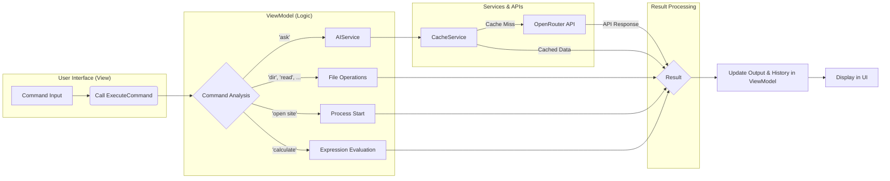

  <a href="README.ru.md">Читать на русском</a>

  <h1 align="center">AI Assistant</h1>
  

    A desktop AI assistant with a graphical interface for OS interaction and content generation.
  

  

## Demonstration

*(A GIF or embedded video demonstrating the assistant will be placed here)*

## 🚀 Key Features

*   **Intelligent Command Parsing:** The application recognizes natural language commands to perform system tasks.
*   **LLM Integration:** Ability to ask questions to an AI that can not only answer but also suggest system commands for execution (`COMMAND: ...`).
*   **OS Interaction:** Support for file operations (create, read, delete), process launching, and opening URLs.
*   **Conversation Context:** The assistant remembers the message history within a session for more meaningful communication.
*   **Modern UI:** An interface based on Avalonia UI with an acrylic effect and a well-thought-out UX.
*   **Caching:** AI responses are cached to speed up repeated requests and save tokens.

## 🛠️ Tech Stack

*   **Language:** C# (.NET 8)
*   **UI Framework:** Avalonia UI
*   **Architectural Pattern:** MVVM (using CommunityToolkit.Mvvm)
*   **API Interaction:** `System.Net.Http.HttpClient`
*   **Serialization:** `System.Text.Json`

## ⚙️ Installation and Setup

*(A guide on installation, setting up environment variables (e.g., `OPENROUTER_API_KEY`), and running the project will be added later.)*

## 📝 Architecture

The application is built on the **MVVM** pattern. The main workflow is as follows:

1.  **View (`MainWindow.axaml`):** The user enters a command into the `TextBox`. UI controls are bound to the `ViewModel`.
2.  **ViewModel (`MainWindowViewModel.cs`):** Contains the core business logic. The user's command is processed in the `ExecuteCommand` method, which acts as a router.
3.  **Router Logic:** Based on keywords (`ask`, `create file`, `dir`, etc.), the `ViewModel` calls the appropriate service or performs the action directly.
4.  **Services:**
    *   `AIService`: Encapsulates the logic for interacting with an external API (e.g., OpenRouter), including request formation and response handling.
    *   `CacheService`: Provides response caching to reduce latency and save resources.
5.  **System Interaction:** Standard .NET APIs (`System.IO`, `System.Diagnostics.Process`) are used to execute system commands (`dir`, `open site`).
6.  **UI Update:** The result of the command execution updates the `ViewModel`'s properties, which is automatically reflected in the `View` due to data binding.

## 🗺️ Roadmap

*   **Command Parser Refactoring:** Replace the bulky `if-else` block with a more flexible architecture (e.g., the Command pattern or a dictionary of delegates).
*   **Security Enhancement:** Implement a sandbox or an additional confirmation step for potentially dangerous commands suggested by the AI.
*   **Feature Expansion:** Add plugin support for integration with other services (calendar, weather, development APIs).
*   **UI/UX Improvements:** Implement syntax highlighting for commands and code-containing responses.
