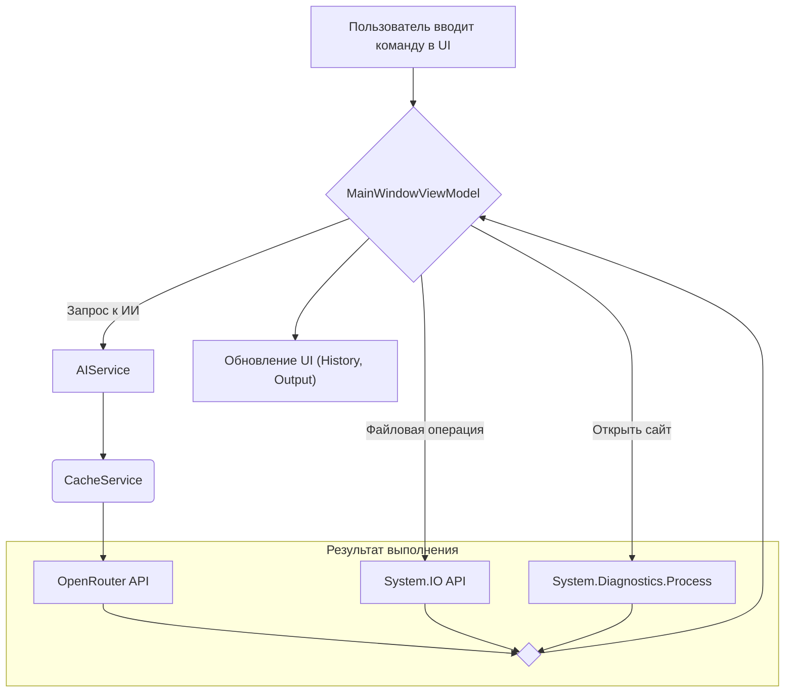

  <h1 align="center">AI Assistant</h1>
  

    Настольный ИИ-ассистент с графическим интерфейсом для взаимодействия с ОС и генерации контента.
  

  

## Демонстрация

*(Здесь будет размещена GIF-анимация или встроенное видео, демонстрирующее работу CLI-ассистента)*

## 🚀 Ключевые возможности

*   **Интеллектуальный парсинг команд:** Приложение распознает команды на естественном языке для выполнения системных задач.
*   **Интеграция с LLM:** Возможность задавать вопросы ИИ, который может не только отвечать, но и предлагать системные команды для выполнения (`COMMAND: ...`).
*   **Взаимодействие с ОС:** Поддержка файловых операций (создание, чтение, удаление), запуск процессов и открытие URL.
*   **Контекст диалога:** Ассистент запоминает историю сообщений в рамках сессии для более осмысленного общения.
*   **Современный UI:** Интерфейс на базе Avalonia UI с акриловым эффектом и продуманным UX.
*   **Кэширование:** Ответы от ИИ сохраняются для ускорения повторных запросов и экономии токенов.

## 🛠️ Технологический стек

*   **Язык:** C# (.NET 8)
*   **UI Фреймворк:** Avalonia UI
*   **Архитектурный паттерн:** MVVM (с использованием CommunityToolkit.Mvvm)
*   **Взаимодействие с API:** `System.Net.Http.HttpClient`
*   **Сериализация:** `System.Text.Json`

## ⚙️ Установка и запуск

*(Руководство по установке, настройке переменных окружения (например, `OPENROUTER_API_KEY`) и запуску проекта будет добавлено позже.)*

## 📝 Архитектура

Приложение построено на паттерне **MVVM**. Основной поток работы выглядит так:

1.  **View (`MainWindow.axaml`):** Пользователь вводит команду в `TextBox`. Элементы управления привязаны к `ViewModel`.
2.  **ViewModel (`MainWindowViewModel.cs`):** Содержит основную бизнес-логику. Команда пользователя обрабатывается в методе `ExecuteCommand`, который действует как маршрутизатор.
3.  **Router Logic:** В зависимости от ключевых слов (`спроси`, `создать файл`, `dir` и т.д.), `ViewModel` вызывает соответствующий сервис или выполняет действие напрямую.
4.  **Services:**
    *   `AIService`: Инкапсулирует логику взаимодействия с внешним API (например, OpenRouter), включая формирование запросов и обработку ответов.
    *   `CacheService`: Обеспечивает кэширование ответов для уменьшения задержек и экономии ресурсов.
5.  **System Interaction:** Для выполнения системных команд (`dir`, `открыть сайт`) используются стандартные API .NET (`System.IO`, `System.Diagnostics.Process`).
6.  **UI Update:** Результат выполнения команды обновляет свойства `ViewModel`, что автоматически отражается в `View` благодаря привязкам данных.

## 🗺️ Перспективы развития (Roadmap)

*   **Рефакторинг парсера команд:** Заменить громоздкий `if-else` на более гибкую архитектуру (например, паттерн "Команда" или словарь делегатов).
*   **Повышение безопасности:** Реализовать "песочницу" или дополнительное подтверждение для потенциально опасных команд, предложенных ИИ.
*   **Расширение функционала:** Добавить поддержку плагинов для интеграции с другими сервисами (календарь, погода, API для разработки).
*   **Улучшение UI/UX:** Внедрить подсветку синтаксиса для команд и ответов, содержащих код.